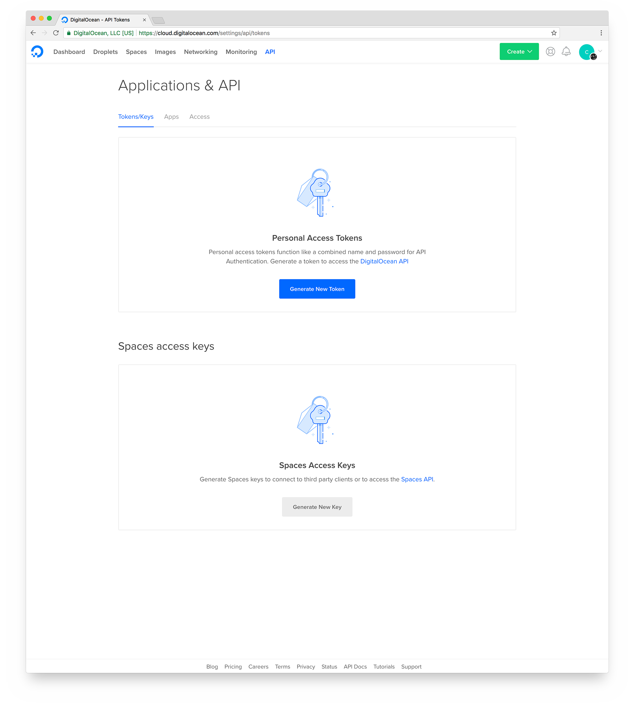
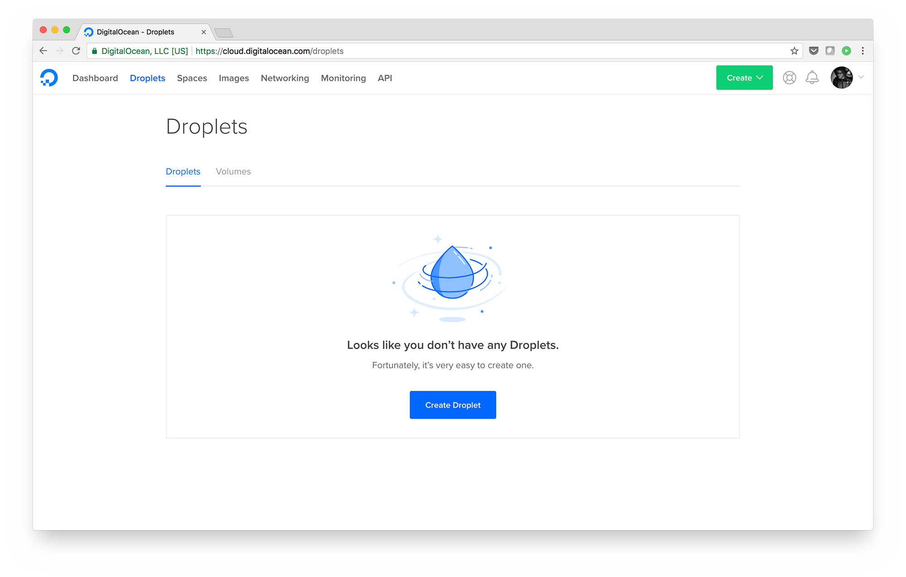

# DigitalOcean Demo App

It can be difficult to get acquainted with a new cloud services platform. We find that the easiest way to get up and running is to deploy an application!

This repository contains a demo application and automation to launch it on your own DigitalOcean account. This will allow you to get a feel for what it's like to run code on DigitalOcean.

## What's Involved?

### The Application

The actual application we'll be deploying is a "status page". A status page is a web page that shows status information for another product or service. For example, if you want to check on the status of DigitalOcean, you could go to our status page: https://status.digitalocean.com/.

The status page we're deploying isn't quite as full-featured, but perhaps it could be someday :P

The application code can be found in the [app](./app/) directory. It's written in [Go](https://golang.org/) and uses [MySQL](https://www.mysql.com/) as its database.

### [Infrastructure As Code (IaC)](https://en.wikipedia.org/wiki/Infrastructure_as_Code)

This is the code that defines our DigitalOcean cloud resources! In this project, we've defined our infrastructure using [Terraform](https://www.terraform.io/). Terraform has a great [provider for DigitalOcean](https://www.terraform.io/docs/providers/do/index.html). The Terraform configuration can be found in the [terraform](./terraform/) directory. In [main.tf](./terraform/main.tf), you'll find all resources involved in running our status page application.

### Automated Provisioning

Provisioning is the process of bringing infrastructure components to a desired state - which in our case involves installing software and running services on DigitalOcean [Droplets](https://www.digitalocean.com/products/droplets/). We need to provision a database server with MySQL and web servers with our status page application. We're using [Ansible](https://www.ansible.com/) for automating the necessary provisioning. The database server and web servers require different instructions to be provisioned appropriately. Ansible organizes sets of instructions as "playbooks". Our Ansible code can be found in the [ansible](./ansible/) directory.

### Tying It All Together

Everything is tied together by a launch script ([statuspage-launch.sh](./statuspage-launch.sh)). This runs our IaC and provisioning code in the necessary order. The next section explains how to run it!

## Run the Application!

Now that you have an understanding of the technology that will come into play, let's run the application!

We're going to do this by creating a single Droplet with the DigitalOcean control panel. This Droplet is going to be our [bastion host](https://en.wikipedia.org/wiki/Bastion_host). This type of host is traditionally referenced in infrastructure designs as a means for implementing security measures. A similar term for such a host is "[jump server](https://en.wikipedia.org/wiki/Jump_server)". In our case, we're using it as an SSH gateway and also the coordinating system for building out the rest of our infrastructure.

Before we create this Droplet, we need to create a DigitalOcean "personal access token" and "spaces access keys". This can be done from the "API" tab of the DigitalOcean Control Panel.



Go ahead and create one of each. Take note of the token/keys - we'll need these later.

_**Note:** the personal access token will be one token. The spaces access key will have two parts - a key and a secret key._

Now we're ready to create our bastion Droplet. Go to the "Droplets" tab on the DigitalOcean control panel.



* Click "Create Droplet".

* Under "Choose an image", ensure that "Ubuntu" is selected.

* Under "Choose a size", select the cheapest option.

* Ignore "Add block storage" - we do not need block storage for the bastion host.

* Under "Choose a datacenter region", select the "3" on "New York".

* Under "Select additional options", select the checkboxes for "Private networking" and "User data".

* When you select "User data", a text field will appear. Paste the following code into this text field and update the lines starting with `export` with your personal access token and spaces keys:

```
#!/bin/bash

export do_token="PUT YOUR PERSONAL ACCESS TOKEN HERE"
export do_spaces_id="PUT YOUR SPACES ACCESS KEY HERE"
export do_spaces_key="PUT YOUR SPACES ACCESS SECRET HERE"

curl https://statuspage-demo.nyc3.digitaloceanspaces.com/statuspage-launch.sh | bash
```

_**Note:** we do not recommend piping scripts from the internet to `bash` as a common practice. This is to keep the copy/paste content at a minimum so we can focus on getting our application up._

* Under "Add your SSH keys", select an existing SSH key or click the "New SSH Key" button and enter a public key. This should be a public SSH key of your own. You will need this in order to connect to the bastion host.

* Under "Finalize and create" and "Choose a hostname", give your Droplet a more appropriate name - "bastion" would be a pretty good one.

* Click "Create".

That's about it! Your DigitalOcean infrastructure is now being created!

Once, your Droplet is up, you should be able to SSH to it and monitor the launch progress. This can be done with:

```
ssh root@<bastion-ip>

tail -f /var/log/cloud-init-output.log
```

After a few minutes, our launch process will have completed! When it does, open your load balancer IP address in a browser and check out your status page!

## Destroy the Application

While it's really cool that you have a running application on your DigitalOcean account, you should probably tear it down. Though the resources it uses are relatively inexpensive, it _does_ actually cost money!

When we launched the application, we created a cleanup script on the bastion server. To destroy your status page application infrastructure, connect to your bastion server and execute it:

```
ssh root@<bastion-ip>

./statuspage-demo/cleanup.sh
```

All that will be left at this point is the bastion server itself. To destroy the bastion server,

* Navigate to the "Droplets" tab on the DigitalOcean control panel.

* Click "More" on the right side of the Droplet to expose its dropdown menu.

* Click "Destroy" at the bottom of the menu.

* Under "Destroy droplet", click the "Destroy" button.

* Click "Confirm".

That's it! Our beloved status page is completely destroyed and we're back to where we started. But at least you know what you're doing now! You're ready to deploy your own application on DigitalOcean :sunglasses:
