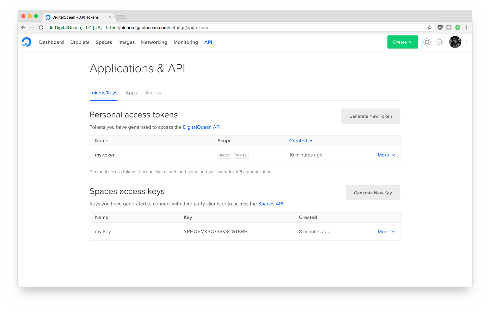
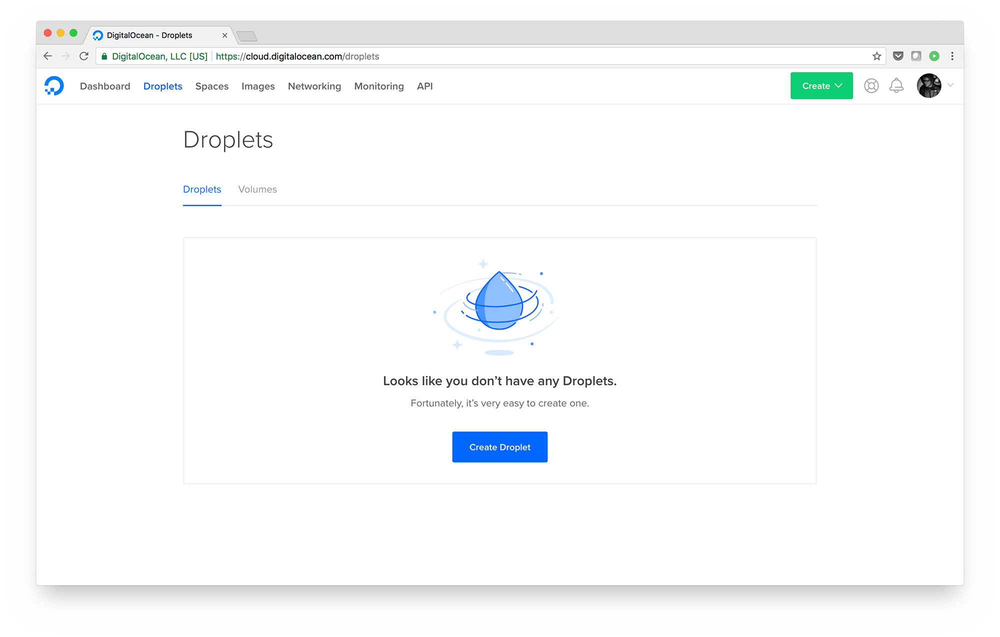
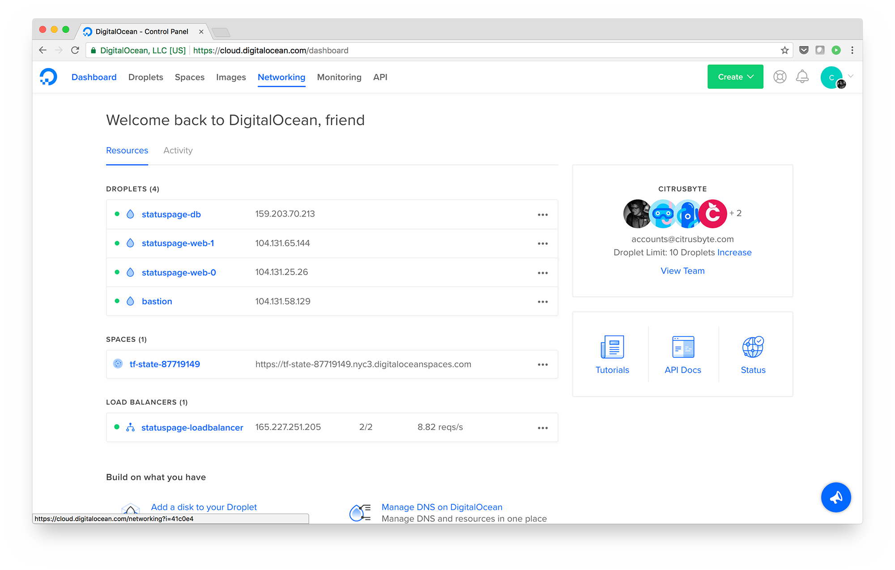
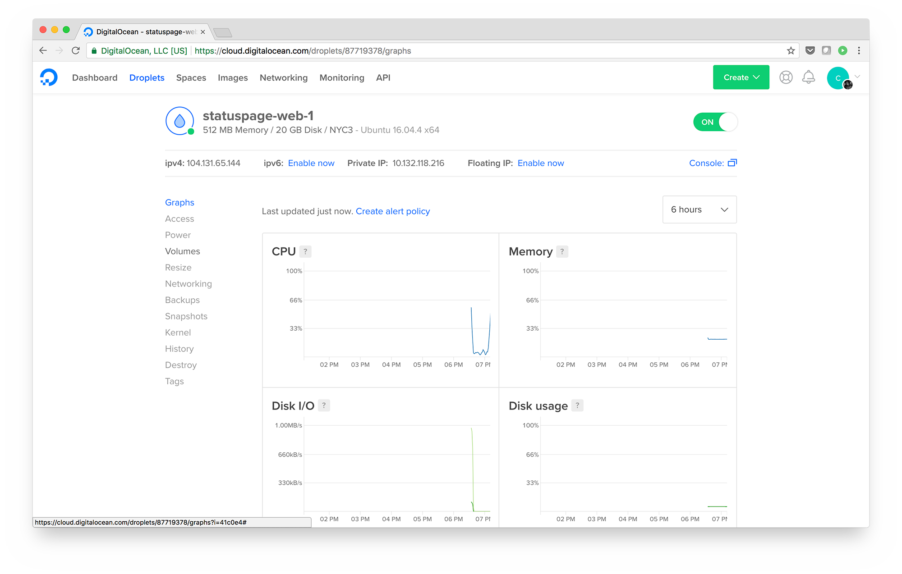

# DigitalOcean Demo App

It can sometimes be difficult to get acquainted with a new cloud services platform. We find that the easiest way to get a sense of how a platform works is to dive in and deploy an application yourself. This repository contains a demo application with automation that you can launch from your DigitalOcean account. This will allow you to see what it's like to run infrastructure on DigitalOcean.

The application we will deploy is a _status page_, a web page that shows status information for a product or service. For example, if you wanted to know whether servers in a specific DigitalOcean datacenter were under maintenance, you would go to [DigitalOcean’s status page](https://status.digitalocean.com/). The status page we will deploy isn't as full-featured as DigitalOcean’s, although it could serve as the groundwork for a more fleshed-out status page.

The application code, which is written in [Go](https://golang.org/), can be found in the [app](./app/) directory. The demo app requires that we provision a database server with [MySQL](https://www.mysql.com/), a pair of web servers that will host our status page application, and a load balancer to distribute traffic between the web servers. All of these components are tied together by a launch script ([statuspage-launch.sh](./statuspage-launch.sh)). This script provisions all the necessary infrastructure and installs all the required software in the correct order; the sections below explain how to run it. If you would like more information on the underlying Terraform and Ansible code utilized by the script, you can read through the final section of the README, [“What’s Involved in this Application”](https://github.com/do-community/demo-app#whats-involved-in-this-application). 


## Running the Application

To launch the application, we will create a single Droplet using the [DigitalOcean control panel](https://cloud.digitalocean.com/droplets). Before we create this Droplet, we need to create a DigitalOcean personal access token and a set of [Spaces](https://www.digitalocean.com/products/spaces/) access keys. This can be done from the "API" tab of the control panel.



Go ahead and create one of each. Take note of the token and keys - we'll need these later.

_**Note:** The personal access token will be a single token. The Spaces access key will have two parts - an access key and a secret key. You will need all three in order to launch the demo application._

The Droplet we will create is going to be our [bastion host](https://en.wikipedia.org/wiki/Bastion_host). This type of host is traditionally used in infrastructure designs to implement security measures. In our case, we're using the bastion host as both an SSH gateway and the coordinating system for building out the rest of our infrastructure.

Go to the **Droplets** tab on the DigitalOcean control panel.



* Click **Create** and select **Droplet**.

* Under **Choose an image**, ensure that **Ubuntu 16.04** is selected.

* Under **Choose a size**, select the cheapest option.

* Ignore **Add block storage** - we do not need block storage for the bastion host.

* Under **Choose a datacenter region**, select the **3** under **New York**.

* Under **Select additional options**, select the checkboxes for **Private networking**, **User data**, and **Monitoring**. _Please be sure you do not select "IPv6". Enabling public IPv6 networking causes Terraform 0.11.5 to crash._

* When you select **User data**, a text field will appear. Add the following code into this text field and update the lines starting with `export` with your personal access token and Spaces keys:

```
#!/bin/bash

export do_token="PUT YOUR PERSONAL ACCESS TOKEN HERE"
export do_spaces_id="PUT YOUR SPACES ACCESS KEY HERE"
export do_spaces_key="PUT YOUR SPACES ACCESS SECRET HERE"
export version="0.0.1"

curl https://raw.githubusercontent.com/do-community/demo-app/v$version/statuspage-launch.sh | bash
```

_**Note:** we do not recommend piping scripts from the internet to `bash` as a common practice. This is to keep the copy/paste content down to a minimum so we can focus on getting the application up and running._

* Under **Add your SSH keys**, select an existing SSH key or click the **New SSH Key** button and enter a public key. This should be a public SSH key of your own, and you will need this in order to connect to the bastion host.

* Under **Finalize and create** and **Choose a hostname**, give your Droplet a more descriptive name, such as "bastion".

* Click **Create**.

With that, your bastion Droplet will be created and the launch script will start to automatically build out the remaining infrastructure resources.

Once your Droplet is up, you can SSH into it and monitor the launch progress. This can be done with:

```
ssh root@<bastion-ip>

tail -f /var/log/cloud-init-output.log
```

After a few minutes, the launch process will finish. Press `CTRL + C` to close out this command.


## Viewing the Status Page

Once the demo app has launched, you can visit the status page by entering your load balancer’s IP address in the address bar of your browser. This IP address can be found in the **Networking** section of the DigitalOcean Control Panel, under **Load Balancers**.


## The DigitalOcean Control Panel

Now that we have our status page running, we can explore the Control Panel to get a better understanding of how all the components of this demo app work with one another.

The DigitalOcean resources we've just created include:

* [Droplets](https://cloud.digitalocean.com/droplets).
* [Spaces](https://cloud.digitalocean.com/spaces).
* [Load Balancers](https://cloud.digitalocean.com/networking/load_balancers).
* [Firewalls](https://cloud.digitalocean.com/networking/firewalls).

You can explore these resources by checking out the dashboard tab:



This provides us with a high-level overview of the DigitalOcean resources we've created. If we click one of our Droplets, it will take us to its Graphs view. Here, we can see some helpful monitoring graphs right on the control panel:



These system metrics are a bit more volatile than you'd expect for infrastructure running an application that's no one's actually using; this is because we've added a job to the bastion server's crontab to send requests to your load balancer. You can check the `/etc/crontab` file on your bastion server so see exactly what it's doing.

In addition to providing these graphs, having monitoring enabled lets you create alerting policies that will allow you to receive notifications when system metrics cross chosen thresholds. You can test out how monitoring works by setting up your own alerting policies in the [Monitoring tab](https://cloud.digitalocean.com/monitors) of the Control Panel. For example, you could set a policy that will alert you whenever your `statuspage-web-0` Droplet’s memory utilization is above 75% for more than 30 minutes.

You can also explore your newly created [Space](https://cloud.digitalocean.com/spaces), [load balancer](https://cloud.digitalocean.com/networking/load_balancers), and [firewalls](https://cloud.digitalocean.com/networking/firewalls) as well.


## Destroying the Application

Although the resources used by the demo application are relatively inexpensive, they _do_ cost money. Though it is helpful with understanding how to run code on DigitalOcean, this app doesn't offer any value on its own. Consequently, you should destroy it before the cost of running its resources becomes excessive.

When we launched the application, we copied a cleanup script onto the bastion server - [statuspage-destroy.sh](./statuspage-destroy.sh). If you look at the script, you'll see that the destruction is coordinated with Terraform. Terraform knows of all the resources it originally created through its state file, which we've stored on DigitalOcean Spaces. Running this cleanup script will not affect any other resources associated with your account.

When you're ready to destroy your status page application, connect to your bastion server to execute the script. This script is the recommended way to destroy the demo app and its various components, and running it means that you won’t have to manually go through and check that everything has been removed:

```
ssh root@<bastion-ip>

./statuspage-demo/statuspage-destroy.sh
```

After a few minutes, this command will produce output notifying you that the destroy process is complete. All that will be left at this point is the bastion server itself. To destroy the bastion server:

* Navigate to the **Droplets** tab on the DigitalOcean control panel.

* Click **More** on the right side of the Droplet to expose its dropdown menu.

* Click **Destroy** at the bottom of the menu.

* Under **Destroy Droplet**, click the **Destroy** button.

* Click **Confirm**.

With this, the status page is completely destroyed and we’re back to where we started. Now you are ready to deploy your own application on DigitalOcean.


## Troubleshooting

As is possible with any application, there’s a chance that you could run into errors when launching the demo app. If you do encounter any issues, the first thing to do is check the cloud-init log on your bastion host. You can run the following command to output the last 100 lines of this log:

```
ssh root@<bastion-ip>

tail -100 /var/log/cloud-init-output.log
```

### API Keys and Tokens

It's a common occurrence that personal access tokens or Spaces access keys are set incorrectly, and this can cause the launch script to fail or throw errors. This section goes over methods for troubleshooting and resolving such problems.

#### Spaces Access Keys

If your Spaces access key is incorrect, you'll see something like the following near the end of your `cloud-init-output.log`:

```
...

botocore.exceptions.ClientError: An error occurred (InvalidAccessKeyId) when calling the ListBuckets operation: Unknown

...

Error loading state: InvalidAccessKeyId:
        status code: 403, request id: tx0000000000000000436da-005ac64745-176e91-nyc3a, host id:

...
```

The following would indicate that your secret key was entered incorrectly:

```
...

botocore.exceptions.ClientError: An error occurred (SignatureDoesNotMatch) when calling the ListBuckets operation: Unknown

...

Error loading state: SignatureDoesNotMatch:
        status code: 403, request id: tx000000000000000008935-005ac64db9-171d53-nyc3a, host id:

...
```

If either occur, start over by deleting your bastion Droplet and create a new one with valid key values in its "User Data" script.

#### Personal Access Tokens

If your personal access token was entered incorrectly, you'll see output like the following:

```
...

Error: digitalocean_droplet.bastion (import id: 88489983): 1 error(s) occurred:

* import digitalocean_droplet.bastion result: 88489983: digitalocean_droplet.bastion: Error retrieving droplet: GET https://api.digitalocean.com/v2/droplets/88489983: 401 Unable to authenticate you.

...
```

Again, the easiest approach would be to start over by deleting your bastion Droplet and creating a new one with a valid token in the "User Data" script.

Alternatively, and if you feel like getting your hands dirty, you could update your token in `/root/statuspage-demo/terraform/token.auto.tfvars` then attempt to re-apply your Terraform configuration with `cd /root/statuspage-demo/terraform/ && terraform apply -auto-approve`.

### Terraform Apply Failure

Another common issue is that the `terraform apply` command failed for some reason or another. If this is the case, you'll see the following accompanied by a list of errors:

```
...

Error: Error applying plan:

...
```

In cloud computing and software in general, there's an _endless_ list of problems that can arise. Because we're depending on so many different services from DNS to DigitalOcean APIs, there's a possibility that one of them didn't behave in the way we needed it to. Terraform does a good job with providing helpful error messages, so you should be able to see what failed in your cloud-init output.

There's a chance that whatever failed will succeed if you re-apply your Terraform configuration. You can do this with the following command:

```
cd /root/statuspage-demo/terraform/ && terraform apply -auto-approve
```

### Other Issues

Debugging infrastructure code can sometimes be tedious, but troubleshooting can also provide an excellent learning experience. If you come across errors that aren’t related to what we have covered and you haven’t been able to determine the cause or solution, we recommend that you start over and recreate your bastion Droplet from scratch.


## What’s Involved in this Application

This demo app was designed to help new users understand the process of deploying an app on DigitalOcean and become familiar with some of DigitalOcean’s products and services. It was also designed so that it could be launched and destroyed as quickly and easily as possible.

To this end, the demo application utilizes two modern technology paradigms: Infrastructure as Code and automated provisioning.

### Infrastructure as Code (IaC)

When creating a new server infrastructure from scratch, many users spin up their Droplets through the DigitalOcean Control Panel. Because this demo application consists of several different components, however, it would be prohibitively slow to create each of them separately. Instead, the installation script included in the bastion host’s User Data creates the rest of the app’s resources through the model of Infrastructure as Code.

[Infrastructure as Code](https://en.wikipedia.org/wiki/Infrastructure_as_Code) describes the process of setting up cloud infrastructure with files that contain computer-readable code. In the context of this demo app, IaC is the code that defines our DigitalOcean cloud resources. Configuring infrastructure this way is a convenient alternative to working with physical servers or through a user interface.

In this project, we've defined our infrastructure using [Terraform](https://www.terraform.io/), which has a great [provider for DigitalOcean](https://www.terraform.io/docs/providers/do/index.html). The Terraform configuration can be found in the [terraform](./terraform/) directory. In [main.tf](./terraform/main.tf), you'll find all resources involved in running our status page application.

### Automated Provisioning

To further streamline the process of getting the application up and running, the demo app utilizes automated provisioning to deploy its various components. This involves automatically installing software and running services on the demo app’s infrastructure, the benefit being that you aren’t required to configure each component separately and test whether they function together correctly.

The demo app uses [Ansible](https://www.ansible.com/) to automate the necessary provisioning. The database server and web servers require different instructions to be provisioned appropriately, and these instructions are organized by Ansible as “playbooks". Our Ansible code can be found in the [ansible](./ansible/) directory.

